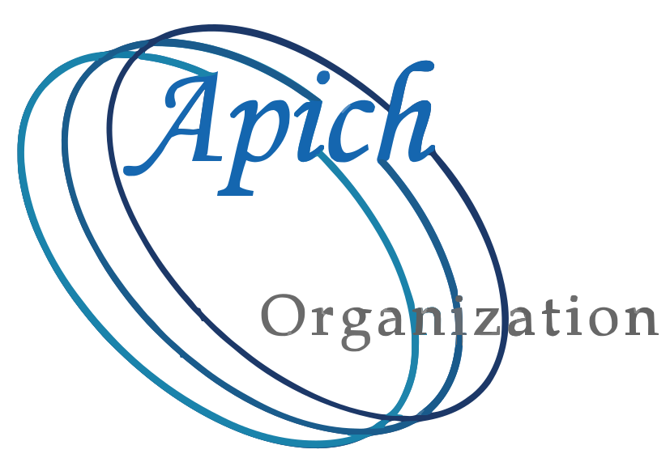

# OLLVM-Next (Ensia)

**⚠️ ETHICAL USE WARNING:** This is a high-strength obfuscation tool. Please read our [Ethics & Disclaimer Notice](./ETHICS.md) before use.

OLLVM-Next (Ensia) is an LLVM-based obfuscator. It is a derivative work, continuing the lineage of the [Hikari](https://github.com/HikariObfuscator/Hikari/), [Hikari-LLVM15](https://github.com/NeHyci/Hikari-LLVM15/), and [Hikari-LLVM19](https://github.com/PPKunOfficial/Hikari-LLVM19/) projects.  
This project aims to provide a functional tool for protecting code on modern LLVM toolchains (versions 21 and 22). It is not meant to be "perfect," but it tries to make the reverse-engineering process more time-consuming.

## **Current Status**

* **Core:** Updated to work with the latest LLVM internal APIs.  
* **Logic:** Uses a specific pass order to ensure different layers of obfuscation build on top of each other without breaking the code.  
* **Intensity:** Offers presets to balance between protection strength and the resulting binary size/speed.

## **Obfuscation Pipeline**

The tool runs passes in a deliberate order to ensure stability. Here is a simplified look at what happens:

1. **Environment Checks:** Includes basic checks for debuggers, hooks, and metadata dumping.  
2. **Data Hiding:** Encrypts strings and constants using different methods (XOR, GF8, Feistel).  
3. **Control Flow:**  
   * **Chaos State Machine (CSM):** Uses a logistic-map to flatten code. This is the strongest mode.  
   * **Flattening:** A fallback for functions that the CSM cannot handle.  
4. **Instruction Complexity:** Uses Substitution and Mixed Boolean-Arithmetic (MBA) to make simple math look complicated.  
5. **Vectorization:** Lifts scalar code into SIMD vectors to confuse analysis tools.  
6. **Cleanup:** Strips debug information and renames internal symbols to hide their purpose.

## **How to Use**

You can use the obfuscator by passing flags to the LLVM compiler:

* \-mllvm \-ensia: Enable the tool.  
* \-mllvm \-enable-medobf: A "medium" setting for production. It uses math complexity and flattening but avoids the slowest passes.  
* \-mllvm \-enable-maxobf: Enables everything at maximum settings. This is very slow and will make your program much larger.
* ... Please see the source code for more details.

### **Environmental Variables**

You can also enable specific features by setting variables in your shell:

* STRCRY=1 (String Encryption)  
* CSMOBF=1 (Chaos State Machine)  
* MBAOBF=1 (MBA Math)
* ... Please see the source code for more details.

## **Important Warnings**

* **Dual-Use:** Please read the [ETHICS.md](./ETHICS.md) file and the the [ETHICS.pdf](./ETHICS.pdf) file. This tool is for protecting your own work or for research.  
* **Stability:** Obfuscation can sometimes introduce bugs or performance issues. Always test your software thoroughly after building it with these flags.  
* **Bloat:** Using "Max Mode" can increase binary size significantly.

## **Licensing & Attribution**

This project is licensed under the **AGPL-3.0**. It includes code and logic from the Hikari and LLVM projects. See [LEGAL.md](./LEGAL.md) for full details on project history and original authors.

## Code of Conduct & Security

Please read the [CODE_OF_CONDUCT.md](./CODE_OF_CONDUCT.md) and [SECURITY.md](./SECURITY.md) files for more details.